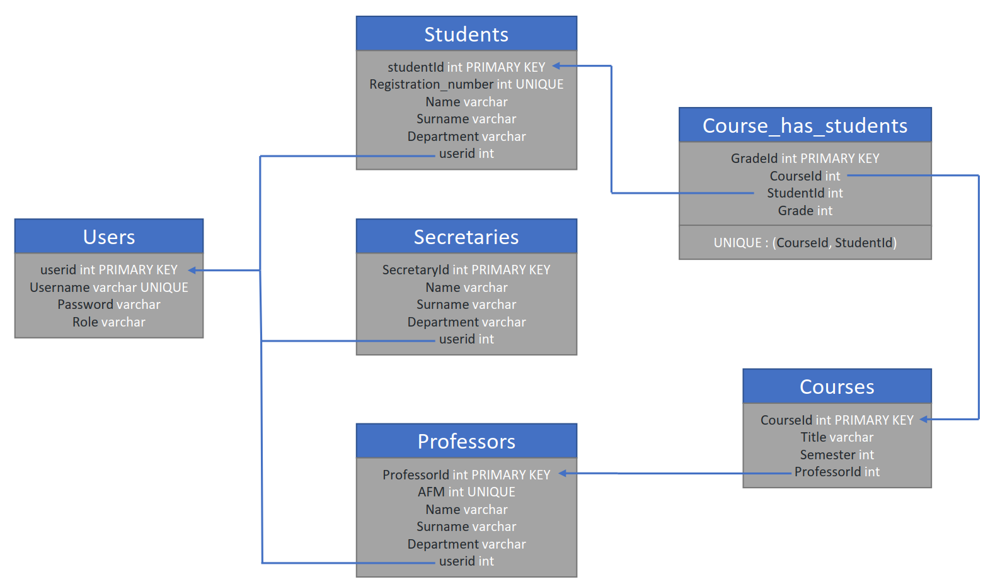

# University Web Application

This is web application made for a university project. The users are supposed to be 'Students', 'Professors' and 'Secreteries'.


The Professors can register the grades for each student and for each course taught, while each Student can access his account to see his grades. The Secretaries can add more students and professors to the database, as well as assign courses to professors and students.


## Details

- The app was developped with Visual Studio 2022 using ```Asp.NET Core framework (Model View Controller) version 6.0```. The language is ```C#```.

- For the database we used ```Microsoft Sql Server 2022``` and the DBMS Microsoft SQL Server Management Studio 18/19.

- Bellow is the relation schema of the database:



- A technical manual and a user manual are also provided in Greek under the ```docs``` folder.

- The session management is handled with a custom way. The Login is performed with the View ```Login.cshtml```, which has the following action method:

```c#
[HttpPost]
public ActionResult Login(User user)
{
    _context = new UniversityDBContext();
    var obj = _context.Users.Where(a => a.Username.Equals(userUsername)
        && a.Password.Equals(user.Password)).FirstOrDefault();

    if (obj != null)
    {
        HttpContext.Session.SetString("username", obj.Username.ToString());
        HttpContext.Session.SetString("userid", obj.Userid.ToString());
        HttpContext.Session.SetString("role",obj.Role.ToString());
        return RedirectToAction("Index", obj.Role);
    }
    return RedirectToAction("Login");
}
```

- Through a Post request, an object of type User is sent to the Server (it contains only the Username and Password fields - the rest are null) and checks if a User with the given credentials exists in the database. If no user is found, a redirection is made to the Login
page. Alternatively, if the corresponding User object is found, 3 fields are created in the Session:

    1. Username
    2. Userid 
    3. Role 

Once the user has logged in, the corresponding Controller is utilized. Each action method performs checks in order to evaluate whether the user has the rights to call it. For example, let's see a method from StudentsController:

```c#
[ResponseCache(NoStore = true, Location = ResponseCacheLocation.None)]
public IActionResult Grades(string? sortOrder)
{
    if (HttpContext.Session.GetString("userid") == null)
        return View("AuthorizationError");
    if (!(HttpContext.Session.GetString("role").Equals("Students")))
        return View("NoRightsError");

    // rest of the code ...
}
```
- Before the business logic of the method is perform, we make sure the user has logged in and has the appropriate role.

## Requirements
- Visual Studio 2022
- Microsoft Sql Server 2022
- Microsoft SQL Server Management Studio 18/19

## Usage
1. Clone the repo or download as .zip

2. Open ```Microsoft SQL Server Management Studio 18/19``` and create a new database

3. Open the sql scrits located inside the folder ```SQL_scripts``` in MSQL Management Studio by choosing ```File > Open```

4. Execute the sql scripts in the following order:
    - SQLQueryTables.sql
    - SQLQueryInsertsPart1.sql
    - SQLQueryInsertsPart2.sql
    - SQLQueryInsertsPart3.sql

5. Now you have a database ready and filled with dummy data for testing

6. Open the .sln file of the project with Visual Studio

7. Place the correct connection script inside the files ```appsettings.json``` and ```Models/UniversityDBContext.cs```

8. App is now ready! You can use the following accounts:
    - Secretary: username: aboyda0, password: Jgx8bp1zRC
    - Professor: username: cbococka, password: Sc5GIg
    - Student: username: jibbesonu, password: pFVJ4ra
